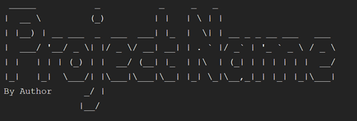

# ASCII Title Generator

## Features
 - Creates customisable ASCII title cards

## Requirements and Installation
 - [Python 3.x](https://www.python.org/)
 - Install all dependencies from the requirements.txt file. `pip3 install -r requirements.txt`

## Usage
 - Copy title_generator.py into your project.
 - Create an object specifying input parameters.
 - To access the ASCII title, use the 'title' attribute.

#### Parameters

Param | Purpose | Default
--- | --- | ---
text | Text used for the title card | N/A
font | [Available Fonts](http://www.figlet.org/fontdb.cgi) | 'big'
width | Character length that the title wraps at | '79'
justify | Align 'left', 'center' or 'right' | 'left'
author | Program/script author | (blank)
target | Which line displays the author. Value is 'n' from last | '2'

#### Sample

    from title_generator import TitleGen
    
    title_obj = TitleGen(text="Project Name", author="Primus27", target=3)
    print(title_obj.title)

##### Result

## Changelog
#### Version 1.0 - Initial release
 - Title generator
 - Ability to add author to title
